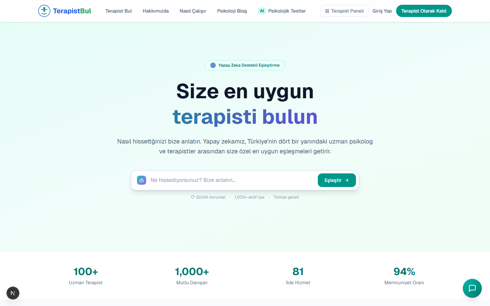
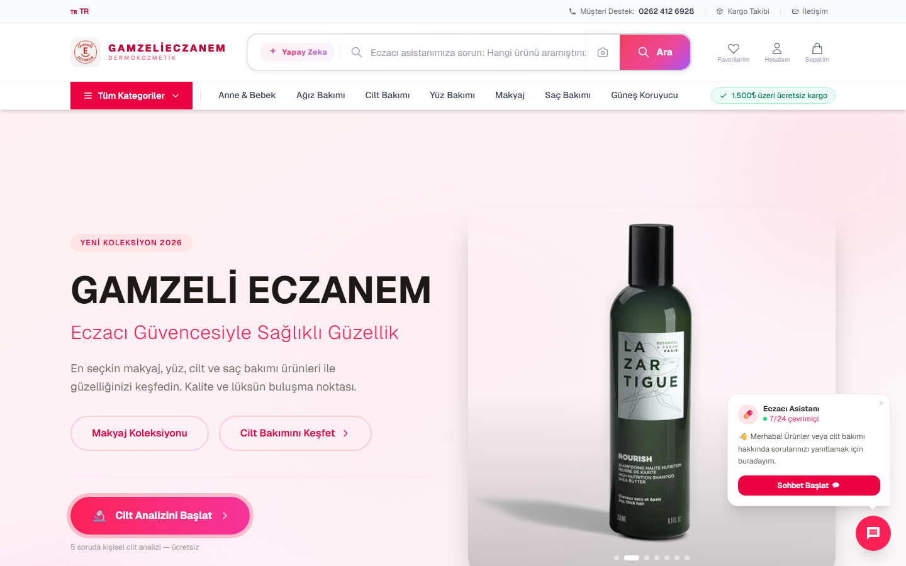

<h1 align="center">Merhaba, ben Atalay 👋</h1>

  Information Systems Engineer | Full-Stack Developer | Data & AI Solutions

  
  

  📧 <a href="mailto:durmazatalay6@gmail.com"><b>durmazatalay6@gmail.com</b></a>

---

## 🚀 Live Demo

<table>
  <tr>
    <td align="center" valign="top" width="33%">
      
        
      
      
        
      <b>AI terapist eşleştirme platformu</b> Video terapi · Realtime sync · Claude chatbot
        
      <a href="https://terapibul-weld.vercel.app"><b>🌐 terapibul-weld.vercel.app →</b></a>
    </td>
    <td align="center" valign="top" width="33%">
      
        
      
      
        
      <b>AI destekli kozmetik e-ticaret</b> Cilt analizi · Sanal makyaj · Iyzico
        
      <a href="https://gamzelidermokozmetik.com"><b>🌐 gamzelidermokozmetik.com →</b></a>
    </td>
    <td align="center" valign="top" width="33%">
      
        
      
      
        
      <b>Online kuaför randevu sistemi</b> Firebase Realtime · EmailJS · Vanilla SPA
        
      <a href="https://bilaler-randevu-app.vercel.app"><b>🌐 bilaler-randevu-app.vercel.app →</b></a>
    </td>
  </tr>
</table>

---

### 🧭 Hakkımda

- 💡 Sağlık, e-ticaret ve hizmet sektörlerinde **AI destekli ürünler** ve tam kapsamlı web uygulamaları geliştiriyorum
- ⚙️ Next.js + React ekosisteminde son kullanıcıya dokunan arayüzler inşa ediyorum
- 🧠 Anthropic Claude ile empatik asistan akışları, Supabase Realtime ile canlı paneller
- 🧪 Playwright ile uçtan-uca test yazmayı, detaylara takılmayı seviyorum
- 📊 Veri madenciliği ve makine öğrenmesi projeleriyle sayıları hikâyeye dönüştürüyorum
- 🤝 Ürün, UX veya backend tarafında yeni projelere açığım

---

## 🛠️ Kullandığım Araçlar

---

## 🌟 Öne Çıkan Projelerim

### 🩺 [TerapiBul](https://github.com/Atalaydurmaz/terapistbul)

**AI destekli terapist eşleştirme ve video terapi platformu.**
Danışanları ihtiyaçlarına uygun uzmanlarla buluşturan, Daily.co tabanlı güvenli video görüşme altyapısı ve Claude destekli psikoloji asistanı sunan bir Next.js uygulaması.

**Öne çıkanlar:** Supabase Realtime senkronizasyon · HMAC imzalı HTTP-only oturum · terapist/admin/danışan panelleri · 60+ Playwright E2E testi
**Stack:** Next.js 16 · React 19 · Supabase · NextAuth v5 · Anthropic Claude · Daily.co · Tailwind · Playwright

  

---

### 💊 [Gamzelieczanem](https://github.com/Atalaydurmaz/GamzeliEczanem-)

**Yapay zekâ destekli kozmetik ve kişisel bakım e-ticaret platformu.**
Eczacı güvencesiyle ürün satışı yapan, AI cilt analizi ve face-api.js ile sanal makyaj deneme sunan Next.js tabanlı tam kapsamlı e-ticaret çözümü.

**Öne çıkanlar:** AI cilt analizi · Sanal makyaj deneme · Iyzico ödeme entegrasyonu · 7/24 Eczacı Asistanı · Terk-sepet cron hatırlatıcısı · Admin paneli
**Stack:** Next.js 16 · React 19 · Supabase · NextAuth · Anthropic Claude · face-api.js · Iyzico · Netgsm SMS · Tailwind

  

---

### ✂️ [Bilal Er Hair Workshop](https://github.com/Atalaydurmaz/bilaler-randevu-app)

**Instagram üzerinden erişilebilen, mobil uyumlu online randevu sistemi.**
Müşterilerin hizmet seçip takvimden randevu almasını sağlayan, Firebase Firestore ile gerçek zamanlı çalışan vanilla SPA.

**Öne çıkanlar:** Hizmet + saat seçimi · Çift randevu engeli · PIN korumalı admin paneli · EmailJS bildirimleri · Mobil öncelikli tasarım
**Stack:** Vanilla JS · Firebase Firestore · EmailJS · Vercel

  <a href="https://bilaler-randevu-app.vercel.app">
    
    &nbsp;&nbsp;
    
  </a>

---

### 🚗 [İkinci El Araç Fiyat Tahmini](https://github.com/Atalaydurmaz/veri-madenciligi-arac-fiyat-tahmini)

**Veri madenciliği dönem projesi.**
arabam.com verilerini kullanarak 10 farklı makine öğrenmesi algoritmasıyla ikinci el araç fiyat tahmini, hiperparametre optimizasyonu, piyasa analizi ve fiyat segmentasyonu.

**Öne çıkanlar:** Veri ön işleme · 10+ ML algoritması (KNN, Karar Ağaçları, Random Forest) · Hiperparametre optimizasyonu · Otomatik rapor üretimi · Piyasa & segmentasyon analizi
**Stack:** Python · pandas · NumPy · scikit-learn · Matplotlib · Seaborn

---

## 📊 GitHub İstatistiklerim

  
  

---

## 🌱 Şu sıralar

- Supabase Realtime üzerinden çok-katmanlı canlı paneller
- Edge runtime'da HMAC imzalı oturum ve middleware tabanlı yetkilendirme
- Claude ile empatik, güvenli AI asistan akışları
- face-api.js ile tarayıcı içi AR deneyimleri

---

## 📬 İletişim

Ortak projeler, freelance işler ya da sadece bir fikir alışverişi için yazmaktan çekinmeyin:
**durmazatalay6@gmail.com**

---

  <em>"İyi yazılım, insana saygı duyan yazılımdır."</em>

